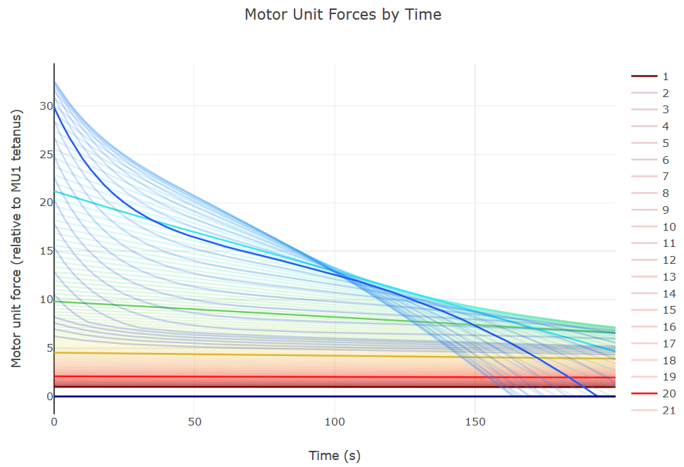

# PyMuscle
PyMuscle provides a motor unit based model of skeletal muscle. It simulates the
relationship between excitatory input and motor-unit output as well as fatigue 
over time.

It is compatible with [OpenAI Gym](https://gym.openai.com) environments and is 
intended to be useful for researchers in the machine learning community.

PyMuscle can be used to enhance the realism of motor control for simulated 
agents. To get you started we provide a [toy example project](https://github.com/iandanforth/pymuscle/tree/master/examples) 
which uses PyMuscle in a simulation of arm curl and extension.

Out of the box we provide a motor neuron pool model and a muscle fiber model
based on "A motor unit-based model of muscle fatigue" 
([Potvin and Fuglevand, 2017](http://journals.plos.org/ploscompbiol/article?id=10.1371/journal.pcbi.1005581)).
If you use this library as part of your research please cite that paper.

We hope to extend this model and support alternative models in the future.

## More about PyMuscle

Motor control in biological creatures is complex. PyMuscle allows you to capture
some of that complexity while remaining [performant](#performance). It provides 
greater detail than sending torque values to simulated motors-as-joints but 
less detail (and computational cost) than a full biochemical model.

PyMuscle is not tied to a particular physics library and can be used with a 
variety of muscle body simulations. PyMuscle focuses on the relationship between 
control signals (excitatory inputs to motor neurons) and per-motor-unit output.

Motor unit output is dimensionless but can be interpreted as force. It can also
be used as a proxy for the contractile state of muscle bodies in the physics
sim of your choice.

# Background

## Motor Units
<p align="center"></p>


A motor unit is the combination of a motor neuron and the muscle fibers to which
the neuron makes connections. Skeletal muscles are made up of many muscle fibers. 
For a given motor unit a single motor neuron will have an axon that branches
and innervates a subset of the fibers in a muscle. Muscle fibers usually
belong to only one motor unit.

Muscles may have anywhere from a few dozen to thousands of motor units. The
human arm, for example, has 30 some muscles and is innervated by [approximately 35,000 axons](https://onlinelibrary.wiley.com/doi/abs/10.1002/ana.25018)
from motor neurons. 

The brain controls muscles by sending signals to motor units and receiving
signals from mechanoreceptors embedded in muscles and the skin. In animals all
the motor units an animal will ever have are present from birth and learning to 
produce smooth coordinated motion through control of those units is a significant 
part of the developmental process.

## Control

Motor units are recruited in an orderly fashion to produce varying levels of 
muscle force. 

The cell bodies of motor neurons for a given muscle cluster together in the 
spinal cord in what are known as motor neuron pools, columns, or nuclei. 
Generally motor neurons in a pool can be thought of as all getting the same 
activation inputs. This input is the combination of dozens if not hundreds of 
separate inputs from interneurons and upper motor neurons carrying signals from
the brain and mechanoreceptors in the body.

In a voluntary contraction of a muscle, say in curling your arm, the input
to the motor neuron pool for the bicep muscle will ramp up, recruiting more
and more motor units, starting from the weakest motor units to stronger ones.

Over time motor neurons and muscle fibers can't produce the same level of force 
for the same level of activation input. This is called fatigue. The brain must
compensate for the fatigue if it wants to maintain a given force or perform
the same action again and again in the same way.

# Installation

### *** Warning: PyMuscle is early stage and under active development. ***

## Requirements

Python 3.6+

## Install

```
pip install pymuscle
```

# Getting Started

### Minimal example 

The Muscle class provides the primary API for the library. A Muscle can be
heavily customized but here we use mainly default values. A PotvinMuscle 
instantiated with 120 motor units has the distribution of strengths, recruitment 
thresholds, and fatigue properties as used in the experiments of Potvin and 
Fuglevand, 2017.

```python
from pymuscle import PotvinMuscle as Muscle
from pymuscle.vis import PotvinChart

# Create a Muscle with small number of motor units.
motor_unit_count = 120
muscle = Muscle(motor_unit_count)

# Set up the simulation parameters
sim_duration = 60  # seconds
frames_per_second = 50
step_size = 1 / frames_per_second
total_steps = int(sim_duration / step_size)

# Use a constant level of excitation to more easily observe fatigue
excitation = 40.0

total_outputs = []
outputs_by_unit = []
print("Starting simulation ...")
for i in range(total_steps):
    # Calling step() updates the simulation and returns the total output
    # produced by the muscle during this step for the given excitation level.
    total_output = muscle.step(excitation, step_size)
    total_outputs.append(total_output)
    # You can also introspect the muscle to see the forces being produced
    # by each motor unit.
    output_by_unit = muscle.current_forces
    outputs_by_unit.append(output_by_unit)
    if (i % (frames_per_second * 10)) == 0:
        print("Sim time - {} seconds ...".format(int(i / frames_per_second)))

# Visualize the behavior of the motor units over time
print("Creating chart ...")
chart = PotvinChart(
    outputs_by_unit,
    step_size
)
# Things to note in the chart:
#   - Some motor units (purple) are never recruited at this level of excitation
#   - Some motor units become completely fatigued in this short time
#   - Some motor units stabilize and decrease their rate of fatigue
#   - Forces from the weakest motor units are almost constant the entire time
chart.display()
```

This will open a browser window with the produced chart. It should look like this:

<p align="center"></p>

### Familiar with OpenAI's Gym?

Make sure you have the following installed

```
pip install gym pygame pymunk
```

then try out the [example project](https://github.com/iandanforth/pymuscle/tree/master/examples)

# Versioning Plan

PyMuscle is in a pre-alpha state. Expect regular breaking changes.

We expect to stabilize the API for 1.0 and introduce breaking changes only
during major releases.

This library tries to provide empirically plausible behavior. As new research is
released or uncovered we will update the underlying model. Non-bug-fix changes
that would alter the output of the library will be integrated in major releases.

If you know of results you believe should be integrated please let us know. See 
the [Contributing](#contributing) section.

# Contributing

We encourage you to contribute! Specifically we'd love to hear about and feature
projects using PyMuscle.

For all issues please search the [existing issues](https://github.com/iandanforth/pymuscle/issues) before submitting.

- [Bug Reports](https://github.com/iandanforth/pymuscle/issues/new?template=bug_report.md)
- [Enhancement requests](https://github.com/iandanforth/pymuscle/issues/new?template=feature_request.md)
- [Suggest research](https://github.com/iandanforth/pymuscle/issues/new?template=research-submission.md) that can better inform the model

_Before_ opening a pull request please:

- See if there is an open ticket for this issue
    - If the ticket is tagged 'Help Needed' comment to note that you intend to work on this issue
    - If the ticket is *not* tagged, comment that you would like to work on the issue
        - We will then discuss the priority, timing and expectations around the issue.
- If there is no open ticket, create one
    - We prefer to discuss the implications of changes before you write code! 


## Development

If you want to help develop the PyMuscle library itself the following may help.

Clone this repository

```
git clone git@github.com:iandanforth/pymuscle.git
cd pymuscle
```

Install [pipenv](https://docs.pipenv.org/). (The modern combination of pip and 
virtual environments.)

```
pip install pipenv
```

If this throws a permissions error you will need to to run this with 'sudo'

```
sudo pip install pipenv
```

Install dependencies and start a clean python environment

```
pipenv install
pipenv shell
```

To exit this python environment

```
exit
```

or close your terminal and start a new one.

# Performance

PyMuscle aims to be fast. We use Numpy to get fast vector computation. PyMuscle
uses only a single process today but may be extended to multi-process in 
the future and to GPUs through the integration of [PyTorch](https://pytorch.org/).

# Limitations

## Scope

PyMuscle is concerned with inputs to motor unit neurons, the outputs of those
motor units, and the changes to that system over time. It does not model the
dynamics of the muscle body itself or the impact of dynamic motion on this
motor unit input/output relationship.

## Recovery

Potvin and Fuglevand 2017 explicitly models fatigue but *not* recovery. We 
eagerly await the updated model from Potvin which will included a model of 
recovery.

## Proprioception

This library does not directly provide any feedback signals for control. The
example project shows how to integrate PyMuscle with a physics simulation to
get simulated output forces and stretch and strain values derived from the
state of the simulated muscle body. (In the example this is a damped spring
but a Hill-type, or more complex model could also be used.)

Fatigue could be used as a feedback signal but this will need to be calculated
from the states of the motor units.
