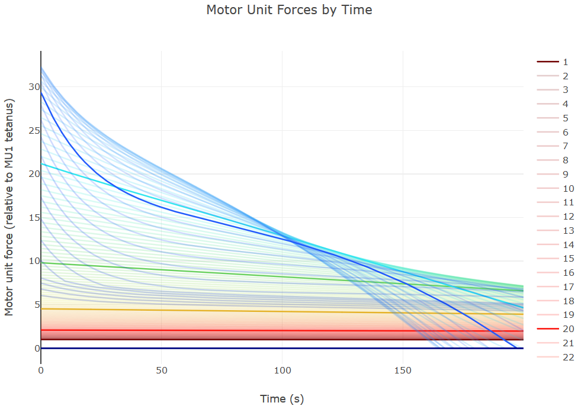

# Getting Started for Physiologists

and other non-ml researchers.

If you're interested in replicating or extending the results of of Potvin and 
Fuglevand, 2017 please start with reviewing [their official repository.](https://github.com/JimPotvin/Potvin_Fuglevand_Muscle_Fatigue_Model)

The matlab code in that repository was re-implemented in Python for this library. (Forked at [15462f](https://github.com/JimPotvin/Potvin_Fuglevand_Muscle_Fatigue_Model/commit/15462f85106ed9ebde3d78ab6fe665c88bf8b32e)) Results
from either set of code should be identical to within floating-point accuracy. Any errors
in this code are entirely mine and not those of the paper's authors.

### Minimal example 

The Muscle class provides the primary API for the library. A Muscle can be
heavily customized but here we use mainly default values. A PotvinFuglevandMuscle 
instantiated with 120 motor units has the distribution of strengths, recruitment 
thresholds, and fatigue properties as used in the experiments of Potvin and 
Fuglevand, 2017. That model is, in turn, based on experimental measurements of
the first dorsal interossei.

```python
from pymuscle import PotvinFuglevandMuscle as Muscle
from pymuscle.vis import PotvinChart

# Create a Muscle
motor_unit_count = 120
muscle = Muscle(motor_unit_count)

# Set up the simulation parameters
sim_duration = 200  # seconds
frames_per_second = 50
step_size = 1 / frames_per_second
total_steps = int(sim_duration / step_size)

# Use a constant level of excitation to more easily observe fatigue
excitation = 40.0

total_outputs = []
outputs_by_unit = []
print("Starting simulation ...")
for i in range(total_steps):
    # Calling step() updates the simulation and returns the total output
    # produced by the muscle during this step for the given excitation level.
    total_output = muscle.step(excitation, step_size)
    total_outputs.append(total_output)
    # You can also introspect the muscle to see the forces being produced
    # by each motor unit.
    output_by_unit = muscle.current_forces
    outputs_by_unit.append(output_by_unit)
    if (i % (frames_per_second * 10)) == 0:
        print("Sim time - {} seconds ...".format(int(i / frames_per_second)))

# Visualize the behavior of the motor units over time
print("Creating chart ...")
chart = PotvinChart(
    outputs_by_unit,
    step_size
)
# Things to note in the chart:
#   - Some motor units (purple) are never recruited at this level of excitation
#   - Some motor units become completely fatigued in this short time
#   - Some motor units stabilize and decrease their rate of fatigue
#   - Forces from the weakest motor units are almost constant the entire time
chart.display()

```

This will open a browser window with the produced chart. It should look like this:

<p align="center"></p>

# Limitations

## Scope

PyMuscle is concerned with inputs to motor unit neurons, the outputs of those
motor units, and the changes to that system over time. It does not model the
dynamics of the muscle body itself or the impact of dynamic motion on this
motor unit input/output relationship.

Separately, functions implementing force-length and force-velocity relationships
of Hill-type muscles are provided in [hill_type.py](https://github.com/iandanforth/pymuscle/blob/master/pymuscle/hill_type.py)

## Recovery

Potvin and Fuglevand 2017 explicitly models fatigue but *not* recovery. We 
eagerly await the updated model from Potvin which will included a model of 
recovery.

Until then the `StandardMuscle` class, which builds on the Potvin and Fuglevand 
base classes, implements peripheral (muscle fiber) recovery as this is a 
relatively simple process but disables central (motor unit fatigue). If you use
instances of `StandardMuscle` or its children please be aware you are stepping off
peer-reviewed ground.

## Proprioception

This library does not directly provide any feedback signals for control. The
example projects show how to integrate PyMuscle with a physics simulation to
get simulated output forces and stretch and strain values derived from the
state of the simulated muscle body. (In the example this is a damped spring
but a Hill-type, or more complex model could also be used.)

Fatigue could be used as a feedback signal but this will need to be calculated
from the states of the motor units.
